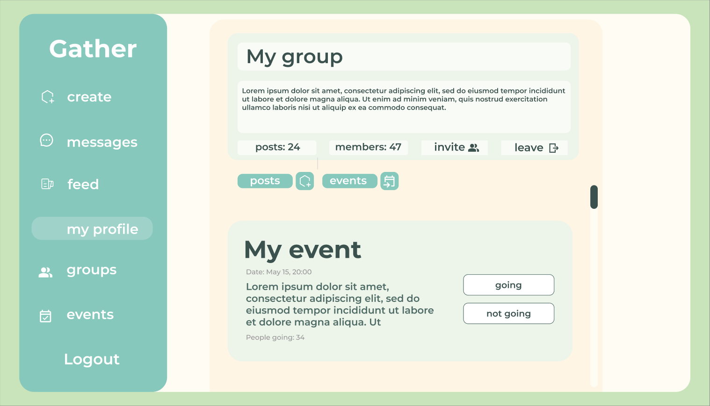
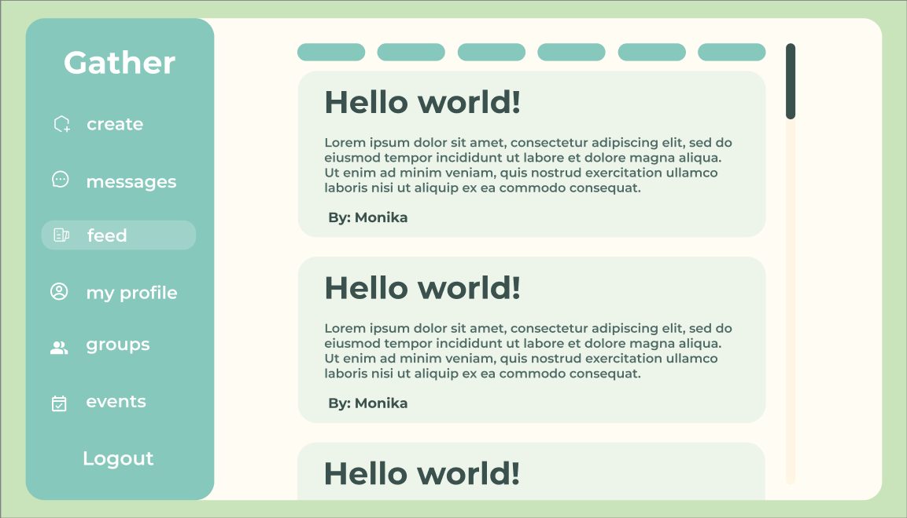
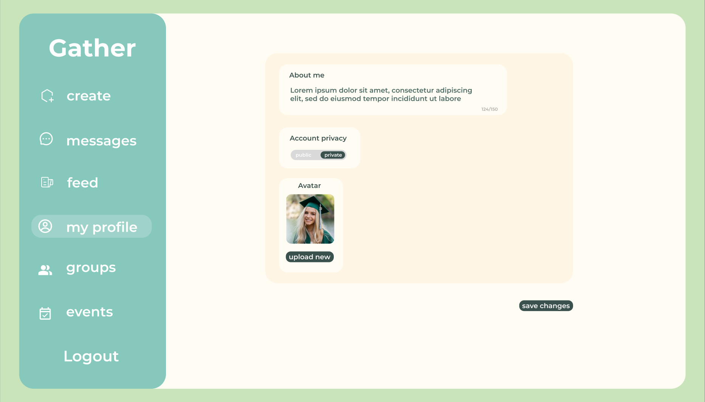
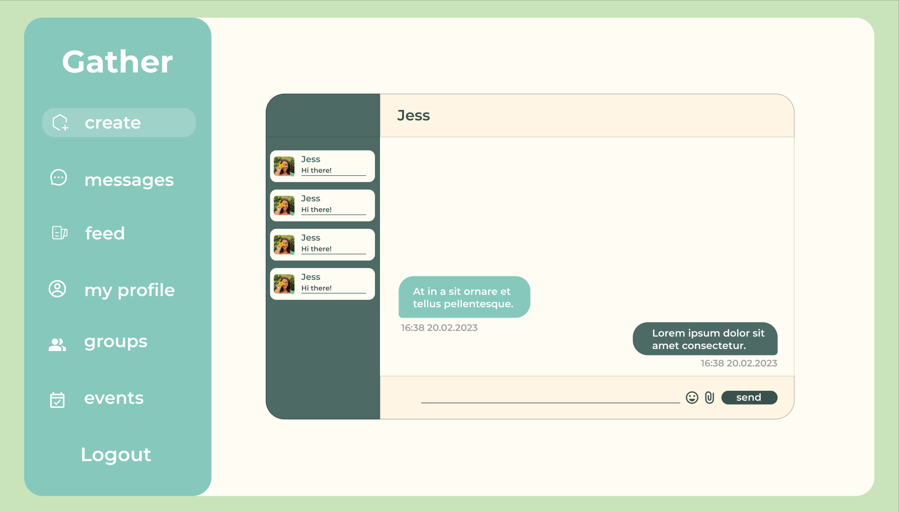

# Social Network

## Table of Contents

- [Social Network](#social-network)
  - [Table of Contents](#table-of-contents)
  - [Project Description](#project-description)
  - [Install](#install)
  - [Technologies Used](#technologies-used)
  - [Features](#features)
  - [Links](#links)
  - [License](#license)

## Project Description

This project is a further expansion of the project Real Time Forum into a Facebook-like social network.

## Install

1. Clone the repository to your local machine.
2. Type **go get .** inside backend folder (../backend) to download all dependencies.
3. Type **yarn install** inside frontend folder (../frontend) to download all dependencies.
4. To start the backend server, run **go run .** inside the backend folder.
5. To start the frontend server, run **npm start** inside the frontend folder.
6. Access the backend server at `http://localhost:8080` and the frontend server at `http://localhost:3000`.
7. If you want to run the project inside the docker containers instead, inside the root of the git repository, run **docker compose up**.

## Technologies Used

- Go
- SQLite
- JavaScript
- CSS
- SCSS
- React
- Gorilla WebSocket
- Docker

## Features

- User authentication and authorization
- User profile customization
- Posts, comments, likes
- Real-time messaging and notifications
- Follower functionality
- Group creation and management
- Events management

## Links

[Project Requirements](https://github.com/01-edu/public/tree/master/subjects/social-network)

## License

This work is licensed under a [Creative Commons Attribution-NonCommercial-NoDerivatives 4.0 International License](https://creativecommons.org/licenses/by-nc-nd/4.0/).

## Screenshots

